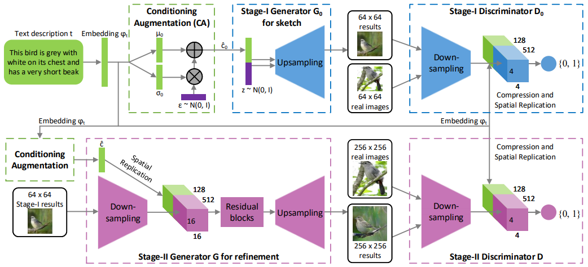
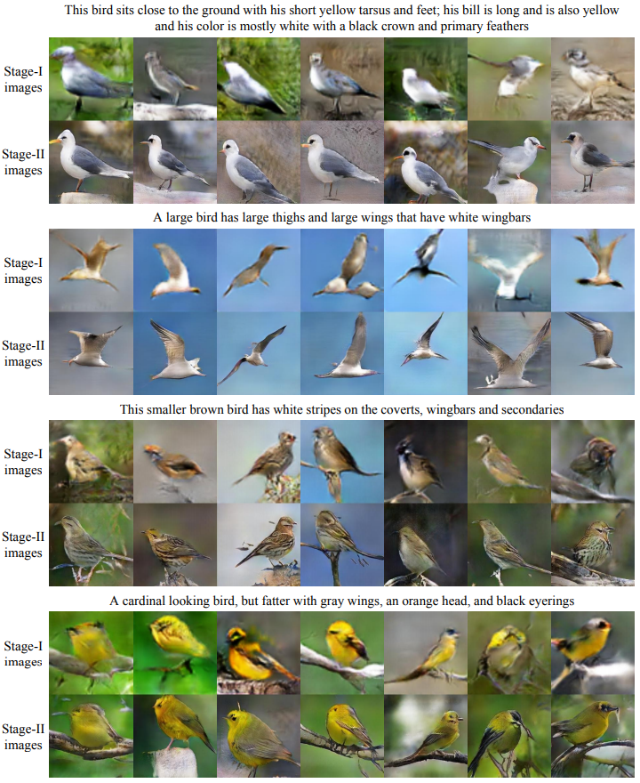

## StackGAN &mdash; Simple TensorFlow Implementation [[Paper]](https://arxiv.org/abs/1612.03242)
### : Text to Photo-realistic Image Synthesis with Stacked Generative Adversarial Networks

<div align="center">
  
</div>

## Dataset
### char-CNN-RNN text embedding
* [birds](https://drive.google.com/open?id=0B3y_msrWZaXLT1BZdVdycDY5TEE)
* [flowers](https://drive.google.com/open?id=0B3y_msrWZaXLaUc0UXpmcnhaVmM)

### Image
* [birds](http://www.vision.caltech.edu/visipedia/CUB-200-2011.html)
* [flowers](http://www.robots.ox.ac.uk/~vgg/data/flowers/102/)

## Usage
```
├── dataset
   └── YOUR_DATASET_NAME
       ├── images
           ├── domain1 (domain folder)
               ├── xxx.jpg (domain1 image)
               ├── yyy.png
               ├── ...
           ├── domain2
               ├── aaa.jpg (domain2 image)
               ├── bbb.png
               ├── ...
           ├── domain3
           ├── ...
       ├── text
           ├── char-CNN-RNN-embeddings.pickle
           ├── filenames.pickle
           ├── ...
```

### Train
```
python main.py --dataset birds --phase train
```

### Test
```
python main.py --dataset birds --phase test
```

## Results
<div align="center">
  
</div>

## Author
[Junho Kim](http://bit.ly/jhkim_ai)
